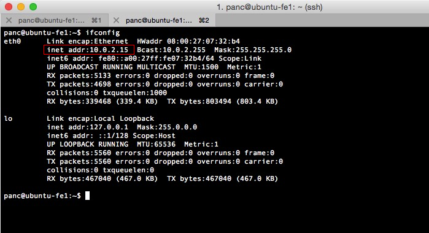

# VirtualBox Networking[^ref_source]

VirtualBox provides up to eight virtual PCI Ethernet cards for each virtual machine. For each such card, you can individually select (1) the hardware that will be virtualized as well as (2) the virtualization mode that the virtual card will be operating in with respect to your physical networking hardware on the host.

Four of the network cards can be configured in the "Network" section of the settings dialog in the VirtualBox GUI. You can configure all eight network cards on the command line via VBoxManage ｀modifyvm｀。

## 1. Virtual Networking Hardware

For each card, you can individually select what kind of hardware will be presented to the virtual machine. VirtualBox can virtualize the following six types of networking hardware:

1. AMD PCNet PCI II (Am79C970A);
2. AMD PCNet FAST III (Am79C973, the default);
3. Intel PRO/1000 MT Desktop (82540EM);
4. Intel PRO/1000 T Server (82543GC);
5. Intel PRO/1000 MT Server (82545EM);
6. Paravirtualized network adapter (virtio-net).

The PCNet FAST III is the default because it is supported by nearly all operating systems out of the box, as well as the GNU GRUB boot manager. As an exception, the Intel PRO/1000 family adapters are chosen for some guest operating system types that no longer ship with drivers for the PCNet card, such as Windows Vista. More details about hardware can be found on [VirtualBox's networking manual page](https://www.virtualbox.org/manual/ch06.html).


## 2. Introduction to Networking Modes

Each of the eight networking adapters can be separately configured to operate in one of the following modes:

1. **Not attached** In this mode, VirtualBox reports to the guest that a network card is present, but that there is no connection -- as if no Ethernet cable was plugged into the card. This way it is possible to "pull" the virtual Ethernet cable and disrupt the connection, which can be useful to inform a guest operating system that no network connection is available and enforce a reconfiguration.

2. **Network Address Translation (NAT)** If all you want is to browse the Web, download files and view e-mail inside the guest, then this default mode should be sufficient for you.

3. **NAT Network** The NAT network is a new NAT flavour introduced in VirtualBox 4.3.

4. **Bridged networking** This is for more advanced networking needs such as network simulations and **running servers in a guest**. When enabled, VirtualBox connects to one of your installed network cards and exchanges network packets directly, circumventing your host operating system's network stack.

5. **Internal networking** This can be used to create a different kind of software-based network which is visible to selected virtual machines, but not to applications running on the host or to the outside world. <font color='red'>One use case is that it can be used for connecting the back end nodes in a cluster.</font>

6. **Host-only networking** This can be used to create a network containing the host and a set of virtual machines, without the need for the host's physical network interface. Instead, a virtual network interface (similar to a loopback interface) is created on the host, providing connectivity among virtual machines and the host.

7. **Generic networking** Rarely used modes share the same generic network interface, by allowing the user to select a driver which can be included with VirtualBox or be distributed in an extension pack.

At the moment there are potentially two available sub-modes:

1. **UDP Tunnel** This can be used to interconnect virtual machines running on different hosts directly, easily and transparently, over existing network infrastructure.

2. **VDE (Virtual Distributed Ethernet) networking** This option can be used to connect to a Virtual Distributed Ethernet switch on a Linux or a FreeBSD host. At the moment this needs compiling VirtualBox from sources, as the Oracle packages do not include it.

### 2.1. Network Address Translation (NAT)

Network Address Translation (NAT) is the simplest way of accessing an external network from a virtual machine. Usually, it does not require any configuration on the host network and guest system. For this reason, it is the default networking mode in VirtualBox.

A virtual machine with NAT enabled acts much like a real computer that connects to the Internet through a router. The "router", in this case, is the VirtualBox networking engine, which maps traffic from and to the virtual machine transparently. In VirtualBox this router is placed between each virtual machine and the host. This separation maximizes security since by default virtual machines cannot talk to each other.

The disadvantage of NAT mode is that, much like a private network behind a router, the virtual machine is invisible and unreachable from the outside internet; you cannot run a server this way unless you set up port forwarding (described below).

The network frames sent out by the guest operating system are received by VirtualBox's NAT engine, which extracts the TCP/IP data and resends it using the host operating system. To an application on the host, or to another computer on the same network as the host, it looks like the data was sent by the VirtualBox application on the host, using an IP address belonging to the host. VirtualBox listens for replies to the packages sent, and repacks and resends them to the guest machine on its private network.

The virtual machine receives its network address and configuration on the private network from a DHCP server integrated into VirtualBox. The IP address thus assigned to the virtual machine is usually on a completely different network than the host. As more than one card of a virtual machine can be set up to use NAT, the first card is connected to the private network 10.0.2.0 (see the following screenshot as an example), the second card to the network 10.0.3.0 and so on. If you need to change the guest-assigned IP range for some reason, please refer to [VirtualBox manual page “Fine-tuning the VirtualBox NAT engine”](https://www.virtualbox.org/manual/ch09.html#changenat).



#### 2.1.1. Configuring Port Forwarding with NAT

As the virtual machine is connected to a private network internal to VirtualBox and invisible to the host, network services on the guest are not accessible to the host machine or to other computers on the same network. However, like a physical router, VirtualBox can make selected services available to the world outside the guest through **port forwarding**. This means that VirtualBox listens to certain ports on the host and resends all packets which arrive there to the guest, on the same or a different port.

To an application on the host or other physical (or virtual) machines on the network, it looks as though the service being proxied is actually running on the host. This also means that you cannot run the same service on the same ports on the host. However, you still gain the advantages of running the service in a virtual machine -- for example, services on the host machine or on other virtual machines cannot be compromised or crashed by a vulnerability or a bug in the service, and the service can run in a different operating system than the host system.

To configure Port Forwarding you can use the graphical Port Forwarding editor which can be found in the Network Settings dialog for Network Adaptors configured to use NAT. Here you can map host ports to guest ports to allow network traffic to be routed to a specific port in the guest. Alternatively command line tool `VBoxManage` could be used; for details, please refer to [VirtualBox's manual page “VBoxManage modifyvm”](https://www.virtualbox.org/manual/ch06.html) or [an example in Chapter 3](../chapter_3/create_one_vm_node.md).

You will need to know which ports on the guest the service uses and to decide which ports to use on the host (often but not always you will want to use the same ports on the guest and on the host). You can use any ports on the host which are not already in use by a service. For example, to set up incoming NAT connections to an ssh server in the guest, use the following command:

```bash
VBoxManage modifyvm "VM name" --natpf1 "guestssh,tcp,,2222,,22"
```

With the above example, all TCP traffic arriving on port 2222 on any host interface will be forwarded to port 22 in the guest. The protocol name `tcp` is a mandatory attribute defining which protocol should be used for forwarding (`udp` could also be used). The name `guestssh` is purely descriptive and will be auto-generated if omitted. The number after `--natpf` denotes the network card, like in other parts of VBoxManage.

To remove this forwarding rule again, use the following command:

```bash
VBoxManage modifyvm "VM name" --natpf1 delete "guestssh"
```

If for some reason the guest uses a **static assigned IP** address not leased from the built-in DHCP server, it is required to specify the guest IP when registering the forwarding rule:

```bash
VBoxManage modifyvm "VM name" --natpf1 "guestssh,tcp,,2222,10.0.2.19,22"
```

This example is identical to the previous one, except that the NAT engine is being told that the guest can be found at the 10.0.2.19 address.

To forward all incoming traffic from a specific host interface to the guest, specify the IP of that host interface like this:

```bash
VBoxManage modifyvm "VM name" --natpf1 "guestssh,tcp,127.0.0.1,2222,,22"
```

This forwards all TCP traffic arriving on the localhost interface (127.0.0.1) via port 2222 to port 22 in the guest.

It is possible to configure incoming NAT connections while the VM is running, see [VirtualBox's manual page “VBoxManage controlvm”](https://www.virtualbox.org/manual/ch08.html#vboxmanage-controlvm).

#### <font color='red'>2.1.2. PXE Booting with NAT</font>

#### 2.1.3. NAT Limitations

There are **four limitations** of NAT mode which users should be aware of:

1. **ICMP protocol limitations** Some frequently used network debugging tools (e.g. `ping` or tracerouting) rely on the ICMP protocol for sending/receiving messages. While ICMP support has been improved with VirtualBox 2.1 (`ping` should now work), some other tools may not work reliably.

2. **Receiving of UDP broadcasts is not reliable** The guest does not reliably receive broadcasts, since, in order to save resources, it only listens for a certain amount of time after the guest has sent UDP data on a particular port. As a consequence, NetBios name resolution based on broadcasts does not always work (but WINS always works). As a workaround, you can use the numeric IP of the desired server in the `\\server\share` notation.

3. **Protocols such as GRE are unsupported** Protocols other than TCP and UDP are not supported. This means some VPN products (e.g. PPTP from Microsoft) cannot be used. There are other VPN products which use simply TCP and UDP.

4. **Forwarding host ports < 1024 impossible** On Unix-based hosts (e.g. Linux, Solaris, Mac OS X) it is not possible to bind to ports below 1024 from applications that are not run by root. As a result, if you try to configure such a port forwarding, the VM will refuse to start.

These limitations normally don't affect standard network use. But the presence of NAT has also subtle effects that may interfere with protocols that are normally working. One example is NFS, where the server is often configured to refuse connections from non-privileged ports (i.e. ports not below 1024).

#### 2.1.4. NAT Service (experimental)

The NAT service works in a similar way to a home router, grouping the systems using it into a network and preventing systems outside of this network from directly accessing systems inside it, but letting systems inside communicate with each other and with systems outside using TCP and UDP over IPv4 and IPv6.

A NAT service is attached to an internal network. Virtual machines which are to make use of it should be attached to that internal network. The name of internal network is chosen when the NAT service is created. An internal network will be created if it does not already exist. An example command[^why_192_168] to create a NAT network is:

```bash
VBoxManage natnetwork add --netname natnet1 --network "192.168.15.0/24" --enable
```

Here, "natnet1" is the name of the internal network to be used and "192.168.15.0/24" is the network address and mask of the NAT service interface. By default in this static configuration the gateway will be assigned the address 192.168.15.1 (the address following the interface address), though this is subject to change. To attach a DHCP server to the internal network, we modify the example as follows:

```bash
VBoxManage natnetwork add --netname natnet1 --network "192.168.15.0/24" --enable --dhcp on
```

or to add a DHCP server to the network after creation:

```bash
VBoxManage natnetwork modify --netname natnet1 --dhcp on
```

To disable it again, use:

```bash
VBoxManage natnetwork modify --netname natnet1 --dhcp off
```

DHCP server provides list of registered nameservers, but doesn't map servers from 127/8 network.

To start the NAT service, use the following command:

```bash
VBoxManage natnetwork start --netname natnet1
```

If the network has a DHCP server attached then it will start together with the NAT network service.

To stop the NAT service, together with DHCP server if any.

```bash
VBoxManage natnetwork stop --netname natnet1
```

To delete the NAT network service use:

```bash
VBoxManage natnetwork remove --netname natnet1
```

This command does not remove the DHCP server if one is enabled on the internal network.

Port-forwarding is supported (using the `--port-forward-4` switch for IPv4 and `--port-forward-6` for IPv6) <font color='red'>TODO: what is the difference from section 2.1.1?</font>:

```bash
VBoxManage natnetwork modify --netname natnet1 --port-forward-4 "ssh:tcp:[]:1022:[192.168.15.5]:22"
```

This adds a port-forwarding rule from the host's TCP 1022 port to the port 22 on the guest with IP address 192.168.15.5. Host port, guest port and guest IP are mandatory. 

To delete the rule, use:

```bash
VBoxManage natnetwork modify --netname natnet1 --port-forward-4 delete ssh
```

It's possible to bind NAT service to specified interface:

```bash
VBoxManage setextradata global "NAT/win-nat-test-0/SourceIp4" 192.168.1.185
```

To see the list of registered NAT networks, use:

```bash
VBoxManage list natnetworks
```

## 2.2. Bridged Networking

With bridged networking, VirtualBox uses a device driver on your host system that filters data from your physical network adapter. This driver is therefore called a "net filter" driver. This allows VirtualBox to intercept data from the physical network and inject data into it, effectively creating a new network interface in software. **When a guest is using such a new software interface, it looks to the host system as though the guest were physically connected to the interface using a network cable: the host can send data to the guest through that interface and receive data from it. This means that you can set up routing or bridging between the guest and the rest of your network.**

For this to work, VirtualBox needs a device driver on your host system. The way bridged networking works has been completely rewritten with VirtualBox 2.0 and 2.1, depending on the host operating system. From the user perspective, the main difference is that complex configuration is no longer necessary on any of the supported host operating systems.

On Macintosh hosts, functionality is limited when using AirPort (the Mac's wireless networking) for bridged networking. Currently, VirtualBox supports only IPv4 over AirPort. For other protocols such as IPv6 and IPX, you must choose a wired interface.

The limitations for using bridged networking on other host OS can be found on [VirtualBox's manual page](https://www.virtualbox.org/manual/ch06.html).

## 2.3. Internal Networking

Internal Networking is similar to bridged networking in that the VM can directly communicate with the outside world. However, the "outside world" is limited to other VMs on the same host which connect to the same internal network.

Even though technically, everything that can be done using internal networking can also be done using bridged networking, there are security advantages with internal networking. In bridged networking mode, all traffic goes through a physical interface of the host system. It is therefore possible to attach a packet sniffer (such as Wireshark) to the host interface and log all traffic that goes over it. **If, for any reason, you prefer two or more VMs on the same machine to communicate privately, hiding their data from both the host system and the user, bridged networking therefore is not an option.[^internal_network_for_cluster_backend]**

Internal networks are created automatically as needed, i.e. there is no central configuration. Every internal network is identified simply by its name. Once there is more than one active virtual network card with the same internal network ID, the VirtualBox support driver will automatically "wire" the cards and act as a network switch. The VirtualBox support driver implements a complete Ethernet switch and supports both broadcast/multicast frames and promiscuous mode.

In order to attach a VM's network card to an internal network, set its networking mode to "internal networking". There are two ways to accomplish this:

- You can use a VM's "Settings" dialog in the VirtualBox graphical user interface. In the "Networking" category of the settings dialog, select "Internal Networking" from the drop-down list of networking modes. Now select the name of an existing internal network from the drop-down below or enter a new name into the entry field.

- You can use command line:

  ```bash
  BoxManage modifyvm "VM name" --nic<x> intnet
  ```
  
  Optionally, you can specify a network name with the command
  
  ```bash
  VBoxManage modifyvm "VM name" --intnet<x> "network name"
  ```

  If you do not specify a network name, the network card will be attached to the network `intnet` by default.
  
  
---

[^ref_source]: This article is copied from [https://www.virtualbox.org/manual/ch06.html](https://www.virtualbox.org/manual/ch06.html).

[^why_192_168]: 192.168.x.x is one of the three reserved classes (class C) of IPs for private network. More explaination can be found on [this blog post](http://trendblog.net/ever-wondered-use-192-168-x-x-ip-addresses-home/).

[^internal_network_for_cluster_backend]: This is the case for the back end nodes for our cluster.