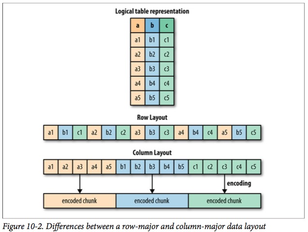

# Chapter 1 Introduction: Big Data, Statistics and Computing

---

- What is big data and the importance of big data.
  * Large Volume
  * High frequency
  * Diverse sources
  * Complex structure, sometimes without a structure

- What we believe about statistical analysis on big data.
  * Exploratory data analysis
    
    John Tukey
    
  * Modeling
  * Estimation
  * Inference
 
- Statistical analysis requires a suitable programming environment
  * Flexible, e.g. define own procedures
  * Rich functionality in statistics and machine learning, e.g. established packages

- Big data brings new challenges to the computing environment
  * Distributed file systems
    + Why using a distributed file system?
    
      Rapid access to the totality of the data.[^rapid_access_data]
      
      Keep a large data set close. This is important for interactive data analysis.
      
      Centrality of data makes it easy to perform large analytical stud‐ ies, like population genetics, large-scale QC analyses, and so on.[^central_data]
      
    + Desired properties for a distributed FS
    + Hadoop HDFS
    + MapR FS 
      
      MapR FS implements the HDFS API with a native C distributed read-write file system[^maprfs]
      
  * Parallel and distributed computing models(or paradigms?)
    + Hadoop YARN/MRv2
    + Spark in-memory computing
  * Suitable programming language
    + R
    + Scala
    + Python

  These facts require a programming paradigm that is sensitive to the characteristics of the underlying system: one that discourages poor choices and makes it easy to write code that will execute in a highly parallel manner.[^bigdata_changes_how_we _do_data_analysis]

  **A framework that makes modeling easy but is also a good fit for production systems is a huge win.**[^what_is_a_good_programming_framework_for_bigdata_analysis]

- Other Considerations
  * Data storage format    
    + Supported data types (e.g. int, double string, array, record)
    + File format (e.g. columnar[^columnar_file_format])
      
      The file format should be chosen such that data is suitable for storing in a distributed file system, otherwise some data processing is need to convert the file format to make it suitable for storing in a distributed file system. For example, [wiggle file format](http://www.ensembl.org/info/website/upload/wig.html) is difficult to read as a splittable file[^wiggle_not_splittable], we need to convert it to some other format such as BED format then save it to a distributed file system such as HDFS.
      
      
      
      Another consideration in choosing a file format is to facilitate data analysis. For example, if interactive data analysis is desired, file formats that are cheap to serialize and deserialize is preferrable. (TODO: not sure if this statement is correct.) 
      
  * Data model

    When we are performing ad hoc analysis, a suitable representation of the underlying analytical objects along with the converion tools will be very helpful. For example, ADAM provide is the set of Avro schemas for genomics analysis. Once data is converted into the corresponding Avro schemas, many large-scale computations become relatively easy to express and distribute.[^Avro_schema_example]
    
    TODO: What are the difference and relationship between these two? -- It (Parquet) is largely based on the underlying data storage format used in Google’s Dremel system (see “Dremel: Interactive Analysis of Web-scale Datasets” Proc. VLDB, 2010, by Melnik et al.), and has a data model that is compatible with Avro, Thrift, and Protocol Buffers.

[^bigdata_changes_how_we _do_data_analysis]: Advanced Analytics with Spark p2.
[^what_is_a_good_programming_framework_for_bigdata_analysis]: Advanced Analytics with Spark p4.
[^maprfs]: https://en.wikipedia.org/wiki/MapR#MapR_Converged_Data_Platform
[^rapid_access_data]: Advanced Analytics with Spark p203.
[^central_data]: Advanced Analytics with Spark p203.
[^columnar_file_format]: It means that values for a particular column from many records are stored contiguously on disk. See Figure 10-2 on p205 of Advanced Analytics with Spark.
[^wiggle_not_splittable]: Advanced Analytics with Spark p207. It is not possible to predict how far back in a file a particular task must read in order to obtain the metadata about the contig coordinates.
[^Avro_schema_example]: Advanced Analytics with Spark p214.