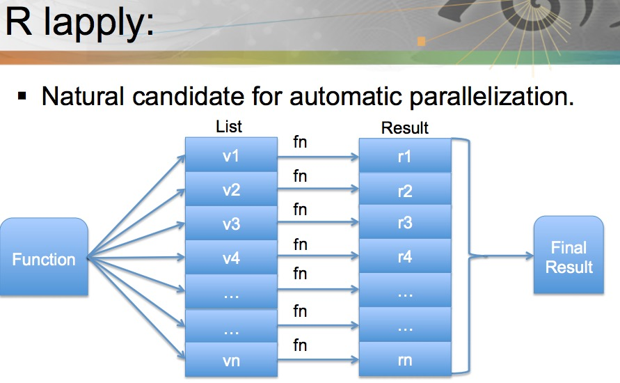

# Chapter 5 Parallel Computing in R

---

**Note** The classification of explicit and implicit paralleliziation is given in [this slides](http://www.labs.hpe.com/research/systems-research/R-workshop/luke-talk1.pdf).

- Explicit paralellization

  Instruct R code to execute operations with multiple R processes (possibly on different machines).
  
  Multiple packages are available: `parallel`, `snow`/`snowfall`, `foreach`.[^R_hpc_packages]  
  
   
  
 **Note** Examples: multicore(mclapply), Rmpi(plapply). [Figure source](http://www.nimbios.org/tutorials/talks/Pragnesh-talk.pdf) 
 
 **Note** [maybe useful reference.pdf](http://www.labs.hpe.com/research/systems-research/R-workshop/luke-talk1.pdf) 

- Implicit paralellization
  
  * uses threads and shared memory (ideally via OpenMP) TODO: similar idea to SupR?
  
    + the user specifies a maximal number of threads to use
    + R decides internally when to use more than one thread, if allowed
    + available in an experimental package `pnmath`[^pnmath_archive]

  * requires no explicit user action once enabled (just call the compiled function in R?)

  * Rcpp and inline

    + Rcpp is a C++ library facilitates the integration of R and C++
    + `inline` package provides functionality to dynamically define R functions and S4 methods with in-lined C, C++ and Fortran.

  * OpenMP
    + It is a shared memory model.
    + It is a Lightweight approach. 
    + Workload is distributed between threads. 
    + Supported by many compilers: GNU, Intel, IBM, NAG and PGI. 

  * OpenMPI

---

[^R_hpc_packages]: The CRAN page of [High-Performance and Parallel Computing with R](https://cran.r-project.org/web/views/HighPerformanceComputing.html) contains such a list of packages.
[^pnmath_archive]: Download the package from [here](http://homepage.stat.uiowa.edu/~luke/R/experimental/). This is the [demo](https://www.olcf.ornl.gov/wp-content/uploads/2011/07/Lecture3.pdf).

---

- [Rmpi](https://bioinfomagician.wordpress.com/2013/11/25/mpi-tutorial-for-r-rmpi/) but OpenMPI is for distributed memory cluster computing?

- pbdR

R has interfaces for calling compiled C/C++, Fortran codes. 

- Call compiled function written with Rcpp, OpenMP. Parallelism with OpenMP using threads. But thread safety is a big concern (TODO: how? [this post](https://wrathematics.github.io/RparallelGuide/#r-and-thread-safety) explains why but I couldn't understand.)

  OpenMP in R Examples:

    - [Parallelization in rcpp via OpenMP](https://wbnicholson.wordpress.com/2014/07/10/parallelization-in-rcpp-via-openmp/)
    - [OPENMP TUTORIAL, WITH R INTERFACE](https://matloff.wordpress.com/2015/01/16/openmp-tutorial-with-r-interface/)

- GPU computing. [Rth](https://github.com/Rth-org/Rth) is a package of functions written in Thrust, callable from R. It thus provides to R programmers a set of parallel applications that run on both GPUs and multicore systems.