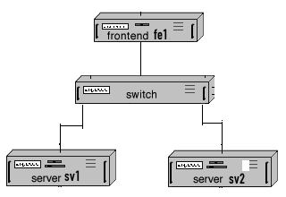

## 2. Creating Additional Virtual Machine Nodes

We have created a VM as the front end of our cluster. In this section, we will create two more VM nodes so that the three nodes can be connected to form a virtual cluster. The following figure shows the diagram[^cluster_diagram_source] of the desired cluster. 

[^cluster_diagram_source]: This diagram is adapted from the one on [https://www.communigate.com/communigatepro/ClusterStatic.html](https://www.communigate.com/communigatepro/ClusterStatic.html).

### 2.1. 