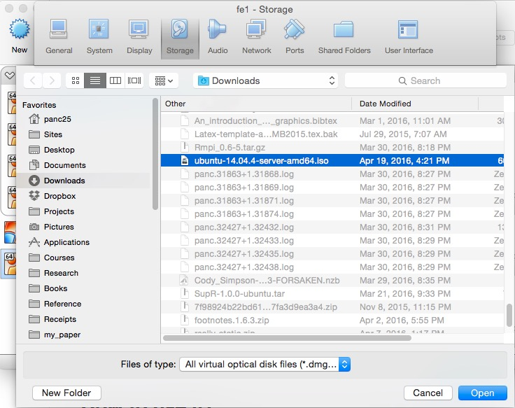
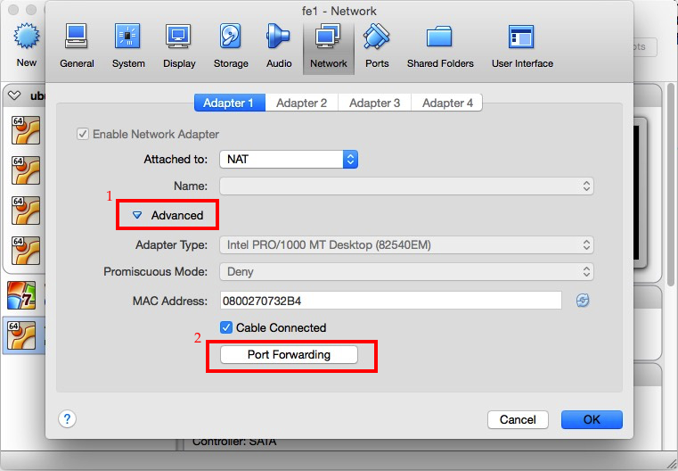
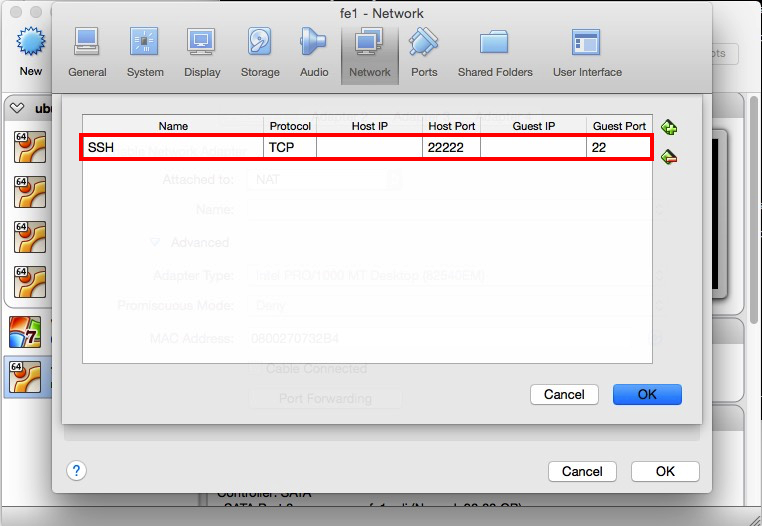

# Virtual Machine Cluster

Cluster can be very expensive to build. It consists of many computer nodes, network switches, internet cable and other hardware equipment. It also requires installation of operating systems and managment softwares to be functioning. Dedicated administrating staff are also needed to maintain the whole system. 

All of above make clusters in-accessible to students and individual researchers. Usually, having access to a real cluster is desirable but not a must for many research programs. At the early stages of many research projects, we usually pilot our method on a small data set or a subset sampled from a big data set. The purpose is to have a preliminary sense of the data at hand and test if the methods could work.

In these cases, a large scale computing environment cannot be fully utilized. It would require a lot of overhead to get access to a cluster even before we can compute a mean for our data. 

Rather, we could use our controllable resources, i.e. personal computers, for emulating such a distributed computing environment. A good way to realize such an emulated environment is to build a local cluster consisting of virtual machines (VMs).

<font color='red'>... Some introduction to the background on virtual machines ...</font>

In this chapter, we demonstrate how to use [Oracle VM VirtualBox](https://www.virtualbox.org/) to build a virtual cluster. In the following example, we will build a cluster with three Ubuntu nodes. The operating system can be any linux distribution (or even windows). Though we only create three nodes, more nodes can be added if your personal computer is powerful enough. 

<font color='red'>... Some discussion on the pros and cons of different linux distributions, such as Ubuntu, Redhat, CentOS, etc. There are also some packaged CD-ROM for easy installation, e.g. ROCKS[^rocks_cluster_url]</font>

[^rocks_cluster_url]: [http://www.rocksclusters.org/wordpress/](http://www.rocksclusters.org/wordpress/) 

The demonstration in this chapter is performed on my Macbook Pro (late 2011) with OS X Yosemite (10.10.5). The hardware configuration of the laptop is listed below:

- CPU: 2.3 GHz Intel Core i5
- RAM: 16G DDR3 1333 MHz
- Disk: 512G SSD
- Graphics: Intel HD Graphics 3000 512 MB

## 1. Installing One Virtual Machine (Node)

We first show how to create a single Ubuntu VM, which will become the base node for creating other nodes in the future. While installing the first node, we don't have to consider network related issues. We defer them to the section where we discuss how to connect multiple nodes as a cluster.

### 1.1. Downloading and Installing VirtualBox

There are two terms we will use very often in this chapter, host system (or simply host) and guest system (or simply guest). The host system is the operating system comes with your personal computer. Throughout this chapter, the host we refer to is Mac OS X. A guest system is the operating system installed on a VM. This this chapter, a guest is referred to Ubuntu Linux. 

Oracle VM VirtualBox is a free and open-source hypervisor[^define_hypervisor] for x86 computers from Oracle Corporation. Developed initially by Innotek GmbH, it was acquired by Sun Microsystems in 2008 which was in turn acquired by Oracle in 2010. This piece of software is needed for creating and managing our VMs. One can obtain a copy of the latest distribution from its download page[^vbox_download_page].

[^define_hypervisor]: A hypervisor or virtual machine monitor (VMM) is a piece of computer software, firmware or hardware that creates and runs virtual machines.
[^vbox_download_page]: [https://www.virtualbox.org/wiki/Downloads](https://www.virtualbox.org/wiki/Downloads)

The following screenshot shows the interface of Virtual Box Manager version 5.0.16.


<font color='red'>TODO: VirtualBox also provides a command line interface ...</font>

### 1.2. Creating a Virtual Machine

After Virtual Box being downloaded, we can use it to create our first VM. The detaled steps are listed as follows.

**Step 1** Click **New** in the tool bar of Virtual Box Manager GUI. In the pop-up window, give a name to the VM you are creating. Since this is our first node which will be used as a front-end of our future cluster, we name it "fe1". Then choose the type of the **Type** as "Linux" and "Version" as "Ubuntu (64-bit)". This is shown in the following figure.


**Step 2** Click **Continue**. This brings us to the window where we set the memory size for our VM. Since the memory on my host is 16G, I decided to give the first node 3 GB (i.e. 3072 MB). This size depends on your computer's configureation. The following figure shows my setting.

 

**Step 3** Click **Continue**. Select the radio button **Create a virtual hard disk now**[^other_options_vdi]. 


[^other_options_vdi]: Alternatively, you can use an existing virtual hard disk (usually a .vdi file) if you have one. Since this is our first time to create a VM, we don't have an existing virtual hard disk. The relationship between a VM and a virtual hard disk is that the VM can be considered as a computer case and the virtual hard disk as the storage.

**Step 4** Click **Create**. The next window allows you to choose the file format for your virtual hard disk. We choose **VDI (VirtualBox Disk Image)**. <font color='red'>... TODO: What are other foramts for? ...</font>

   

**Step 5** Click **Continue**. The next window asks you to choose the type of storage of VM on physical hard disk (i.e. Macbook Pro). Here, we choose **Dynamically allocated**. The description is quite clear.

 

**Step 6** Click **Continue**. In the next window, we need to decide the location where the virtual hard disk file (.vdi format) is stored and the size of the hard disk for the VM. If you use the default setting, the file will be created in `Virtual Box installation location/system version/vm name/`. In this demonstration, the Virtual Box installation location is in our home account `$HOME/VirtualBox VMs` where `HOME` is an environment variable. The system version is **ubuntu** and our VM name is **fe1**. So the default path for the virtual hard disk file is `$HOME/VirtualBox VMs/ubuntu/fe1/fe1.vdi`. The hard disk size is like the HDD or SSD on a physical computer. Here we set it as 30 GB[^extend_vm_hard_disk].

 


[^extend_vm_hard_disk]: In case the VM's hard disk is full, we can extend its size and the file system of Linux. More details are deferred to later sections. 

**Step 7** Click **Create**. 

 

After the seven steps above, our first VM is created in Virtual Box with the virtual hard disk file created. This is like we have assemabled a physical computer. The next step for building a full-fledged computer node is to install the operating system. 

**Note** By default, VM Manager configures the networking for your VM as NAT. <font color='red'>(TODO: correct?)</font> By using NAT, the gues VM is getting a private IP address (10.x.x.x). When NAT networking is enabled for a guest VM, VirtualBox automatically performs network address translation between the guest VM and host's network stack, so that you do not have to configure anything on the host machine and local network for the guest VM's networking to work.The implication of such NAT, however, is that the guest VM is not reachable or visible from external networks as well as from the local host itself. This is a problem if you want to access the guest VM from the host machine for some reason (e.g., SSH). If you want to access a NAT guest from the host on VirtualBox, you can enable port forwarding for VirtualBox NAT, either from the GUI or from the command line. <font color='red'>TODO: copied from [a downloaded article](../reference/access-nat-guest-from-host-virtualbox.pdf), need rewriting. </font> The demonstration will be provided in a later section. 


### 1.3. Installing the Operating System

#### 1.3.1. Downloading Ubuntu Installation Disk Image

At the time of writing this book, the long term supper (LTS)[^explain_LTS] version of Ubuntu server is 14.04.4[^download_link]. Though the latest version is 15.10 is available, we choose to use a more stable version. We choose the server distribution instead of the desktop distribution is because we want to keep the system light-weight. Since the memory and disk storage is limited on a personal computer, we want to keep the operating system as minimal as possible. 

[^explain_LTS]: More details about LTS can be found at [https://wiki.ubuntu.com/LTS](https://wiki.ubuntu.com/LTS).
[^download_link]: Ubuntu 14.04.4 ISO can be downloaded from the server page [http://www.ubuntu.com/download/server](http://www.ubuntu.com/download/server)

After Ubuntu 14.04.4 ISO being downloaded, we can install it in the VM we just created. The installation process is similar to installing Ubuntu on a physical computer. 

#### 1.3.2. Configure Boot Device and Order

Since our VM is not empty, it cannot be booted from a normal hard drive. Instead, we need to configure the VM to boot from the ISO file we just downloaded. In order to accomplish this, first select the VM "fe1" we just created and click **Settings** in the Virtual Box Manager GUI.


Then, under the **Storage** tab, click the <font color='red'>disk icon with a plus sign (TODO: replace with an inline image)</font> next to **Controller: IDE**.


Next, in the pop-up dialogue window, click **Choose disk**, then choose the ubuntu iso file we just downloaded and click **Open**. 

 



Now, you can see from the Storage window that _ubuntu_14.04.4-server-amd64.iso_ is listed as a new IDE device.


After adding the ISO file as a new IDE device, we also need to tell VM to boot from this device. 

Go back to **Setting**, and select the **System** tab. 


In the pop-up window, **Optical** device is listed as the second boot device, we need to move it to the top by clicking the <font color='red'>up arrow TODO: replace with inline image</font>. Then, click **Ok**. 


#### 1.3.3. Installing Ubuntu Server

We have created an empty VM, downloaded the OS image file, and configured the boot order. Now, we are ready to install the OS. The installation of the OS is similar to the the installation on a physical computer. The following describes the detailed steps.

**Step 1** Start "fe1" VM in the VM Manager by double clicking its icon. A new window will show up which is your "computer monitor". Alternatively, you can start the installation window via **right click "fe1"** -> **Start** -> **Normal Start**. In the window, choose your desired language for your installation (we choose English).

**Step 2** Choose **Install Ubuntu Server**.

**Step 3** Choose the language (English) again and your location (Normally the country you live. This is used for your time zone. So we choose China). <font color='red'>combination of China and English not recognized.</font>

**Step 4** Configure the keyboard. Choose **Detect keyboard layout**.

**Step 5** Configure the network. Give your node a hostname. It is used to refer to this node by this name later on without using its IP address. We use "ubuntu-fe1". You can use any name your want. 

**Note** The hostname of your laptop is "localhost" and its IP address is 127.0.0.1.

**Note** By specifying the hostname, Ubuntu will write the information to the file `/ect/hostname`.

**Step 6** Set up user and passwords. While root account is available in a Linux OS, it is highly recommended to create your own account for non-administrative activities. In this step, provide your real name (Pan Chao), your account username (panc), and password (passward). The installation process also gives you the option to encrypt your home directory. Since this section is for demonstration purpose, we choose **No**.

**Note** It will take some time to configure the time for the system.

**Step 7** Configure disk partitioning. It configures the native Linux file system on the available disk space (30GB). We choose **Guided - use entire disk and set up LVM**. Follow the instruction to configure your file system. This may take a while. 

**Note** LVM stands for Logical Volume Management. It is a system of managing logical volumes, or filesystems, that is much more advanced and flexible than the traditional method of partitioning a disk into one or more segments and formatting that partition with a filesystem. More details can be found on [Ubuntu's wiki page](https://wiki.ubuntu.com/Lvm).

**Note** In case your disk is not large enough, we can allocate more disk space to a VM and expand the file system. Useing LVM has the implication on how we expand the file system. A detailed discussion will be deferred to a later section. 

**Note** Skip configuring HTTP proxy since we are not using any.

**Step 8** Configure tasksel. We choose **No automatic updates**. We will manually updates softwares.

**Step 9** Select pre-installed softwares. By default, only the core of the OS is installed. We choose to install **OpenSSH server** and **LAMP server**. In order to make the selection, use up and down arrows for navigation and hit Space to select.

**Note** LAMP is a software bundle consisting of Linux OS, Apache HTTP Server, MySQL relational database management system (RDBMS), and the PHP programming language. 

**Note** During the installation of MySQL, you will be asked to assign a root password. We simly use "root" as the password. 

**Step 10** Install GRUB boot loader. Briefly, a boot loader is the first software program that runs when a computer starts. It is responsible for loading and transferring control to the operating system kernel software (such as the Hurd or Linux). The kernel, in turn, initializes the rest of the operating system (e.g. GNU)<font color='red'>(copied from [GNU GRUB](https://www.gnu.org/software/grub/))</font>. More details can be found on [GNU GRUB's page](https://www.gnu.org/software/grub/).

**Step 11** Finish the installation and reboot. At the login prompt, type your username and password we just specified in Step 6. 


Now we have installed our first VM which is used as the front end in our VM cluster. 

#### 1.3.4. SSH VM from Host

Though our VM is fully functional which can be accessed via its VM Manager terminal, the font is kinda ugly <font color='red'>(TODO: or use primitive?)</font> and it lacks the ability of copying and pasting. The terminal software on our host system (e.g. Terminal on OS X) provides a better appearance and more functionality. It would be desirable to be able to ssh to and operate on the guest system from within the host's terminal. In order to enable this feature, we have to configure VirtualBox properly.

**Configuration through VirtualBox VM Manager's GUI**

Since the guest ues NAT networking, this can be accomplished by enabling port forwarding for VirtualBox NAT, either from the GUI or from the command line. This section provides the detailed steps for configuring port forwarding from the GUI.

**Step 1** In VM Manager, choose the VM "fe1", and open **Setting** window of the VM. Click on the **Network** tab on the top, click on "Advanced" to expand the additional network adapter options.

**Step 2** Click on a button labeled **Port Forwarding**. You will see a window where you can configure port forwarding rules. 

 

**Step 3** Click on **Add** icon in the upper right corner. Add a new port forwarding rule with the following detail.

- Name: SSH
- Protocol: TCP
- Host IP: (optional) 127.0.0.1
- Host Port: 22222 (any unused port number higher than 1024) <font color='red'>TODO: I tried 2222, but "Host key verification failed".</font>
- Guest IP: (optional) IP address of the guest VM
- Guest Port: 22


 

**Configuration through VirtualBox's commandline interface**

VirtualBox provides a commandline tool, called `VBoxManage`, to enable operation on VM Manager in a terminal shell. In order to use it for VM port forwarding, use the following command:

```bash
VBoxManage modifyvm "fe1" --natpf1 "SSH,tcp,,22222,,22"
```

**Log in guest from host**

After the above configurations, you can now ssh to the guest OS by typing the following command in your host's terminal shell:

```bash
ssh panc@localhost -p 22222
```

where `panc` is the username of the account for Ubuntu and the option `-p 22222` passes the forwarded port number as an argument. 

```
The authenticity of host '[localhost]:22222 ([127.0.0.1]:22222)' can't be established.
RSA key fingerprint is 6c:02:8e:e6:c9:7f:91:0f:f6:07:9d:13:00:83:f9:ce.
Are you sure you want to continue connecting (yes/no)?
```

Simply type `yes` to confirm that you want to proceed and then type the password for your Ubuntu account, i.e. `password`. Now, you are in the Ubuntu VM "fe1".


Now you can preform all kinds of operation on Ubuntu from within your host's terminal shell, which is nativly integrated with your host system. 

**Simplify your life with an SSH config file**

Using the above command requires remembering the username, hostname and port number. If you have to log in and out of many servers in your daily work and you have poor memory like me, it would be very painful. 

One solution is to cut down the verbosity by creating a simpler alias for each command. For example, edit your `$HOME/.bash_profile` file <font color='red'>(TODO: What is the difference between `.bash_profile` and `.bashrc`?)</font> by appending the following line:

```bash
alias ssh-fe1='ssh panc@localhost -p 22222'
```

Then you can log in the guest (after `source($HOME/.bash_profile)`) by simply typing `ssh-fe1`. This works just fine.

Alternatively, there is a much more elegant and fexiable solution to this problem. This is done by eiditing your `$HOME/.ssh/config` file. If you cannot `config` file in the `$HOME/.ssh/` directory, just create one. Enter the `config` file the following:

```
Host ubuntu-fe1
  HostName localhost
  Port 22222
  User panc
```

Now, we can simply run `ssh ubuntu-fe1`, and the options will be read automatically from the configuration file. 

**Passwordless login**

Though using an alias or an ssh configuration file relive the burden of rememnber the usernames, hostnames and various options, each time we still need to type the password. A more important motivation for enabling passwordless login is that most distributed computing systems use ssh for network communication. So a passwordless setup is required. 

Password login is set through creating and configuring public/private keypairs. 

#### 1.3.5. Installing Useful Softwares

- **Java** Java is commonly used as the run time environment for many <font color='red'>(almost all?)</font> big data systems including Hadoop and Spark. At the time of writing, Java 8 is released <font color='red'>(TODO: How about their support for Java 8?)</font>.

  There are multiple versions of Java available for Ubuntu Linux, including OpenJDK and Oracle JDK <font color='red'>(TODO: other JDK version on Ubuntu?)</font>.

## 2. Create more nodes and connect as a cluster