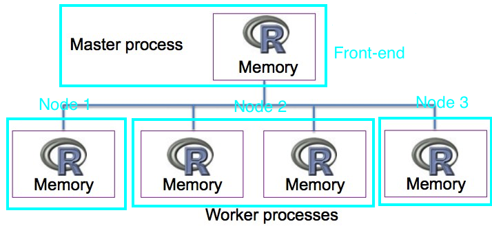

# Explicit Parallelization

---

Call R packages and following certain ways to write codes.

- Rmpi

  R interface to MPI APIs.
  
  R is required at each compute node. 
  
   
**Note** [Figure source](http://www.nimbios.org/tutorials/talks/Pragnesh-talk.pdf) with adaptation.