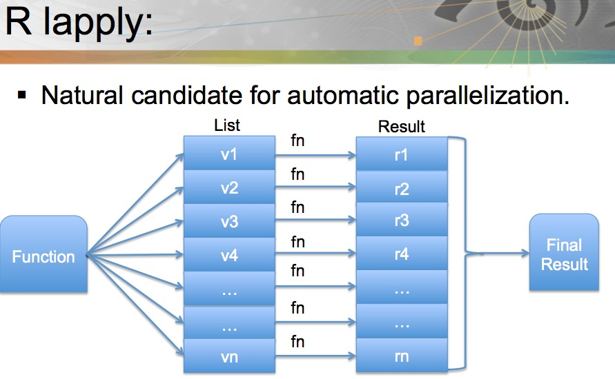

# Explicit Parallelization

---

Instruct R code to execute operations with **multiple R processes** (possibly on different machines).
  
  Multiple packages are available: `parallel`, `snow`/`snowfall`, `foreach`.[^R_hpc_packages]  
  
   
  
 **Note** Examples: multicore(mclapply), Rmpi(plapply). [Figure source](http://www.nimbios.org/tutorials/talks/Pragnesh-talk.pdf) 
 
 **Note** [maybe useful reference.pdf](http://www.labs.hpe.com/research/systems-research/R-workshop/luke-talk1.pdf) 

- Rmpi

  R interface to MPI APIs.
  
  R is required at each compute node. 
  
   
**Note** [Figure source](http://www.nimbios.org/tutorials/talks/Pragnesh-talk.pdf) with adaptation.

