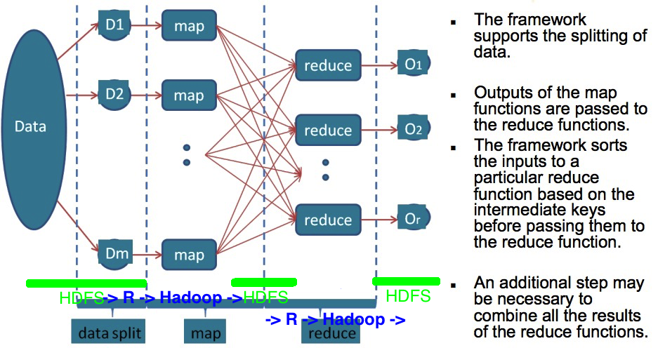

# Tessera

---

**Note** [Figure source](http://www.nimbios.org/tutorials/talks/Pragnesh-talk.pdf) with adaptation.

- HDFS ＋ MapReduce

  * HDFS as distributed data storage
    + Read data from HDFS to multiple workers on different nodes (keep data close)

  * Hadoop YARN/MRv2 as the computing backend
    + Map: Process data on each worker (parallel)
    + Reduce: Shuffle data (map output) and do additional processing on each worker

- R as the front end
- Rhipe as the connector between R and Hadoop