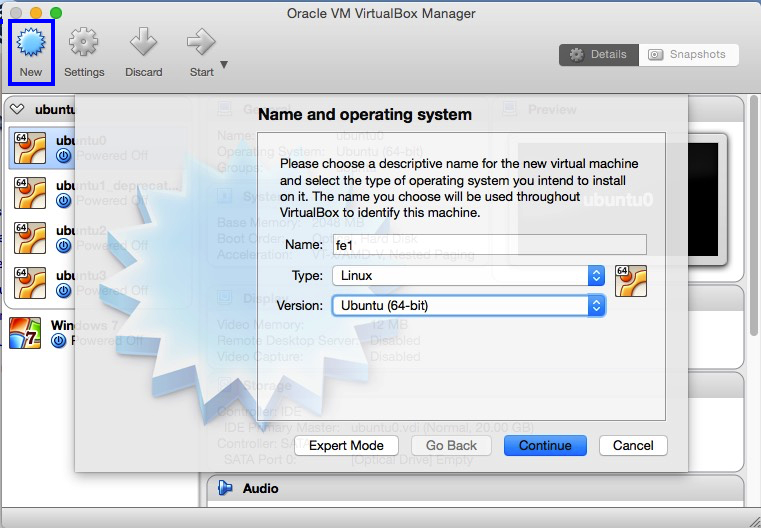
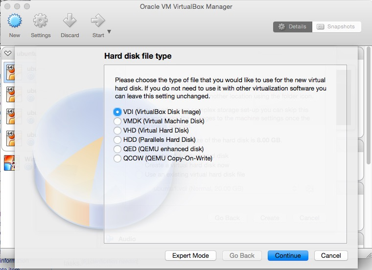
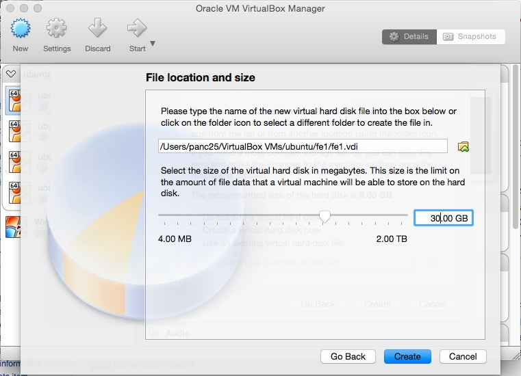
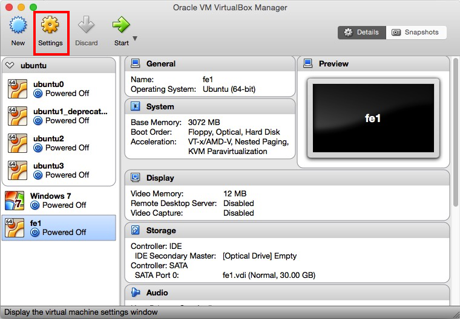
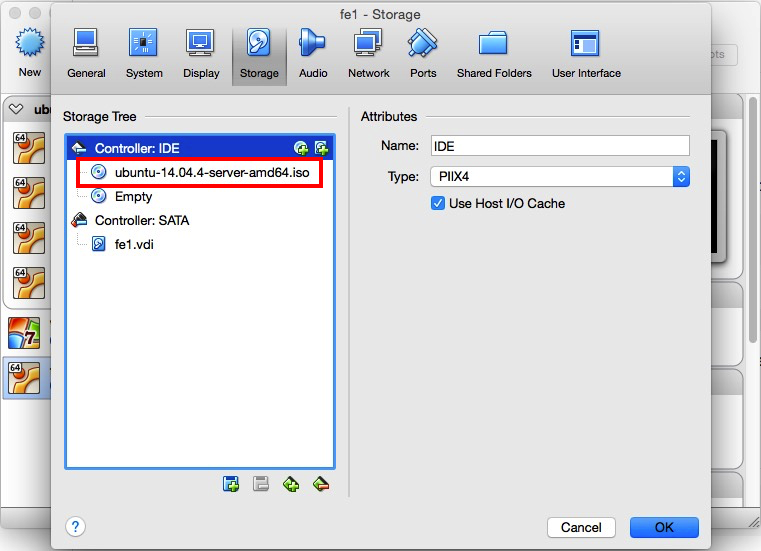
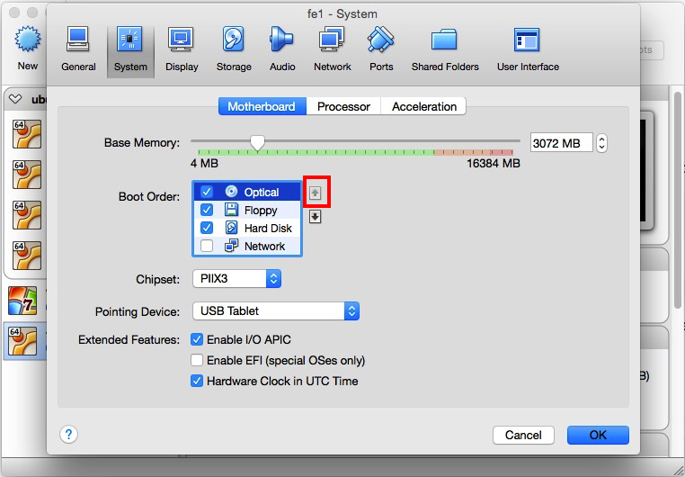

# Virtual Machine Cluster

Cluster can be very expensive to build. It consists of many computer nodes, network switches, internet cable and other hardware equipment. It also requires installation of operating systems and managment softwares to be functioning. Dedicated administrating staff are also needed to maintain the whole system. 

All of above make clusters in-accessible to students and individual researchers. Usually, having access to a real cluster is desirable but not a must for many research programs. At the early stages of many research projects, we usually pilot our method on a small data set or a subset sampled from a big data set. The purpose is to have a preliminary sense of the data at hand and test if the methods could work.

In these cases, a large scale computing environment cannot be fully utilized. It would require a lot of overhead to get access to a cluster even before we can compute a mean for our data. 

Rather, we could use our controllable resources, i.e. personal computers, for emulating such a distributed computing environment. A good way to realize such an emulated environment is to build a local cluster consisting of virtual machines (VMs).

... Some introduction to the background on virtual machines ...

In this chapter, we demonstrate how to use [Oracle VM VirtualBox](https://www.virtualbox.org/) to build a virtual cluster. In the following example, we will build a cluster with three Ubuntu nodes. The operating system can be any linux distribution (or even windows). Though we only create three nodes, more nodes can be added if your personal computer is powerful enough. 

... Some discussion on the pros and cons of different linux distributions, such as Ubuntu, Redhat, CentOS, etc. There are also some packaged CD-ROM for easy installation, e.g. ...

The demonstration in this chapter is performed on my Macbook Pro (late 2011) with OS X Yosemite (10.10.5). The hardware configuration of the laptop is listed below:

- CPU: 2.3 GHz Intel Core i5
- RAM: 16G DDR3 1333 MHz
- Disk: 512G SSD
- Graphics: Intel HD Graphics 3000 512 MB

## 1. Installing One Virtual Machine (Node)

We first show how to create a single Ubuntu VM, which will become the base node for creating other nodes in the future. While installing the first node, we don't have to consider network related issues. We defer them to the section where we discuss how to connect multiple nodes as a cluster.

### 1.1. Downloading and Installing VirtualBox

There are two terms we will use very often in this chapter, host system (or simply host) and guest system (or simply guest). The host system is the operating system comes with your personal computer. Throughout this chapter, the host we refer to is Mac OS X. A guest system is the operating system installed on a VM. This this chapter, a guest is referred to Ubuntu Linux. 

Oracle VM VirtualBox is a free and open-source hypervisor[^define_hypervisor] for x86 computers from Oracle Corporation. Developed initially by Innotek GmbH, it was acquired by Sun Microsystems in 2008 which was in turn acquired by Oracle in 2010. This piece of software is needed for creating and managing our VMs. One can obtain a copy of the latest distribution from its download page[^vbox_download_page].

[^define_hypervisor]: A hypervisor or virtual machine monitor (VMM) is a piece of computer software, firmware or hardware that creates and runs virtual machines.
[^vbox_download_page]: [https://www.virtualbox.org/wiki/Downloads](https://www.virtualbox.org/wiki/Downloads)

The following screenshot shows the interface of Virtual Box Manager version 5.0.16.

### 1.2. Creating a Virtual Machine

After Virtual Box being downloaded, we can use it to create our first VM. The detaled steps are listed as follows.

**Step 1** Click **New** in the tool bar of Virtual Box Manager GUI. In the pop-up window, give a name to the VM you are creating. Since this is our first node which will be used as a front-end of our future cluster, we name it "fe1". Then choose the type of the **Type** as "Linux" and "Version" as "Ubuntu (64-bit)". This is shown in the following figure.

**Step 2** Click **Continue**. This brings us to the window where we set the memory size for our VM. Since the memory on my host is 16G, I decided to give the first node 3 GB (i.e. 3072 MB). This size depends on your computer's configureation. The following figure shows my setting.

 

**Step 3** Click **Continue**. Select the radio button **Create a virtual hard disk now**[^other_options_vdi]. 

[^other_options_vdi]: Alternatively, you can use an existing virtual hard disk (usually a .vdi file) if you have one. Since this is our first time to create a VM, we don't have an existing virtual hard disk. The relationship between a VM and a virtual hard disk is that the VM can be considered as a computer case and the virtual hard disk as the storage.

**Step 4** Click **Create**. The next window allows you to choose the file format for your virtual hard disk. We choose **VDI (VirtualBox Disk Image)**. ... TODO: What are other foramts for? ...

   

**Step 5** Click **Continue**. The next window asks you to choose the type of storage of VM on physical hard disk (i.e. Macbook Pro). Here, we choose **Dynamically allocated**. The description is quite clear.

 

**Step 6** Click **Continue**. In the next window, we need to decide the location where the virtual hard disk file (.vdi format) is stored and the size of the hard disk for the VM. If you use the default setting, the file will be created in `Virtual Box installation location/system version/vm name/`. In this demonstration, the Virtual Box installation location is in our home account `$HOME/VirtualBox VMs` where `HOME` is an environment variable. The system version is **ubuntu** and our VM name is **fe1**. So the default path for the virtual hard disk file is `$HOME/VirtualBox VMs/ubuntu/fe1/fe1.vdi`. The hard disk size is like the HDD or SSD on a physical computer. Here we set it as 30 GB[^extend_vm_hard_disk].

 

[^extend_vm_hard_disk]: In case the VM's hard disk is full, we can extend its size and the file system of Linux. More details are deferred to later sections. 

**Step 7** Click **Create**. 

 

After the seven steps above, our first VM is created in Virtual Box with the virtual hard disk file created. This is like we have assemabled a physical computer. The next step for building a full-fledged computer node is to install the operating system. 

**Note** By default, VM Manager configures the network interface for your VM as NAT. 

### 1.3. Installing the Operating System

#### 1.3.1. Downloading Ubuntu Installation Disk Image

At the time of writing this book, the long term supper (LTS)[^explain_LTS] version of Ubuntu server is 14.04.4[^download_link]. Though the latest version is 15.10 is available, we choose to use a more stable version. We choose the server distribution instead of the desktop distribution is because we want to keep the system light-weight. Since the memory and disk storage is limited on a personal computer, we want to keep the operating system as minimal as possible. 

[^explain_LTS]: More details about LTS can be found at [https://wiki.ubuntu.com/LTS](https://wiki.ubuntu.com/LTS).
[^download_link]: Ubuntu 14.04.4 ISO can be downloaded from the server page [http://www.ubuntu.com/download/server](http://www.ubuntu.com/download/server)

After Ubuntu 14.04.4 ISO being downloaded, we can install it in the VM we just created. The installation process is similar to installing Ubuntu on a physical computer. 

#### 1.3.2. Configure Boot Device and Order

Since our VM is not empty, it cannot be booted from a normal hard drive. Instead, we need to configure the VM to boot from the ISO file we just downloaded. In order to accomplish this, first select the VM "fe1" we just created and click **Settings** in the Virtual Box Manager GUI.

Then, under the **Storage** tab, click the disk icon with a plus sign (TODO: replace with an inline image) next to **Controller: IDE**.

Next, in the pop-up dialogue window, click **Choose disk**, then choose the ubuntu iso file we just downloaded and click **Open**. 

 

Now, you can see from the Storage window that _ubuntu_14.04.4-server-amd64.iso_ is listed as a new IDE device.

After adding the ISO file as a new IDE device, we also need to tell VM to boot from this device. 

Go back to **Setting**, and select the **System** tab. 

In the pop-up window, **Optical** device is listed as the second boot device, we need to move it to the top by clicking the up arrow TODO: replace with inline image. Then, click **Ok**. 

#### 1.3.3. Installing Ubuntu Server

We have created an empty VM, downloaded the OS image file, and configured the boot order. Now, we are ready to install the OS. The installation of the OS is similar to the the installation on a physical computer. The following describes the detailed steps.

**Step 1** Start "fe1" VM in the VM Manager by double clicking its icon. A new window will show up which is your "computer monitor". Alternatively, you can start the installation window via **right click "fe1"** -> **Start** -> **Normal Start**. In the window, choose your desired language for your installation (we choose English).

**Step 2** Choose **Install Ubuntu Server**.

**Step 3** Choose the language (English) again and your location (Normally the country you live. This is used for your time zone. So we choose China). combination of China and English not recognized.

**Step 4** Configure the keyboard. Choose **Detect keyboard layout**.

**Step 5** Configure the network. Give your node a hostname. It is used to refer to this node by this name later on without using its IP address. We use "ubuntu-fe1". You can use any name your want. 

**Note** The hostname of your laptop is "localhost" and its IP address is 127.0.0.1.

**Note** By specifying the hostname, Ubuntu will write the information to the file `/ect/hosts`.

**Step 6** Set up user and passwords. While root account is available in a Linux OS, it is highly recommended to create your own account for non-administrative activities. In this step, provide your real name (Pan Chao), your account username (panc), and password (passward). The installation process also gives you the option to encrypt your home directory. Since this section is for demonstration purpose, we choose **No**.

**Step 7** 

## 2. Create more nodes and connect as a cluster