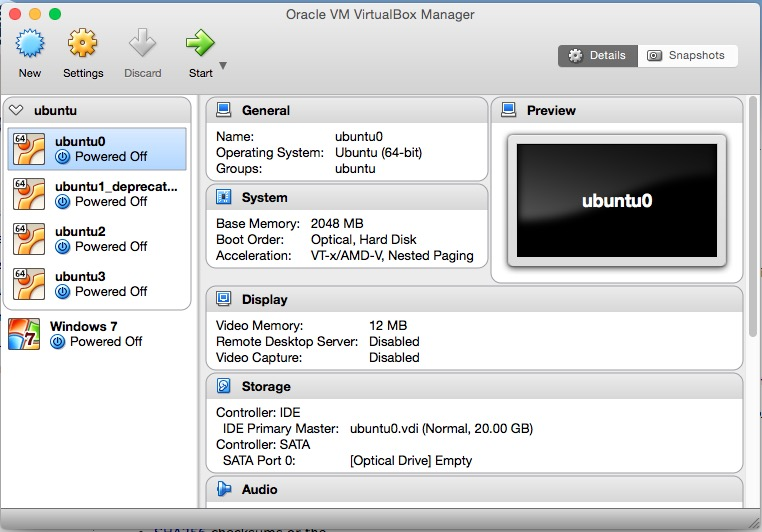

# Virtual Machine Cluster

Cluster can be very expensive to build. It consists of many computer nodes, network switches, internet cable and other hardware equipment. It also requires installation of operating systems and managment softwares to be functioning. Dedicated administrating staff are also needed to maintain the whole system. 

All of above make clusters in-accessible to students and individual researchers. Usually, having access to a real cluster is desirable but not a must for many research programs. At the early stages of many research projects, we usually pilot our method on a small data set or a subset sampled from a big data set. The purpose is to have a preliminary sense of the data at hand and test if the methods could work.

In these cases, a large scale computing environment cannot be fully utilized. It would require a lot of overhead to get access to a cluster even before we can compute a mean for our data. 

Rather, we could use our controllable resources, i.e. personal computers, for emulating such a distributed computing environment. A good way to realize such an emulated environment is to build a local cluster consisting of virtual machines (VMs).

... Some introduction to the background on virtual machines ...

In this chapter, we demonstrate how to use [Oracle VM VirtualBox](https://www.virtualbox.org/) to build a virtual cluster. In the following example, we will build a cluster with three Ubuntu nodes. The operating system can be any linux distribution (or even windows). Though we only create three nodes, more nodes can be added if your personal computer is powerful enough. 

... Some discussion on the pros and cons of different linux distributions, such as Ubuntu, Redhat, CentOS, etc. There are also some packaged CD-ROM for easy installation, e.g. ...

The demonstration in this chapter is performed on my Macbook Pro (late 2011) with OS X Yosemite (10.10.5). The hardware configuration of the laptop is listed below:

- CPU: 2.3 GHz Intel Core i5
- RAM: 16G DDR3 1333 MHz
- Disk: 512G SSD
- Graphics: Intel HD Graphics 3000 512 MB

## 1. Installing One Virtual Machine (Node)

We first show how to create a single Ubuntu VM, which will become the base node for creating other nodes in the future. While installing the first node, we don't have to consider network related issues. We defer them to the section where we discuss how to connect multiple nodes as a cluster.

### 1.1. Downloading and Installing VirtualBox

There are two terms we will use very often in this chapter, host system (or simply host) and guest system (or simply guest). The host system is the operating system comes with your personal computer. Throughout this chapter, the host we refer to is Mac OS X. A guest system is the operating system installed on a VM. This this chapter, a guest is referred to Ubuntu Linux. 

Oracle VM VirtualBox is a free and open-source hypervisor[^define_hypervisor] for x86 computers from Oracle Corporation. Developed initially by Innotek GmbH, it was acquired by Sun Microsystems in 2008 which was in turn acquired by Oracle in 2010. This piece of software is needed for creating and managing our VMs. One can obtain a copy of the latest distribution from its download page[^vbox_download_page].

[^define_hypervisor]: A hypervisor or virtual machine monitor (VMM) is a piece of computer software, firmware or hardware that creates and runs virtual machines.
[^vbox_download_page]: [https://www.virtualbox.org/wiki/Downloads](https://www.virtualbox.org/wiki/Downloads)

The following screenshot shows the interface of Virtual Box Manager version 5.0.16.

### 1.1. Downloading and Installing Ubuntu

At the time of writing this book, the long term supper (LTS)[^explain_LTS] version of Ubuntu server is 14.04.4[^download_link]. Though the latest version is 15.10 is available, we choose to use a more stable version. We choose the server distribution instead of the desktop distribution is because we want to keep the system light-weight. Since the memory and disk storage is limited on a personal computer, we want to keep the operating system as minimal as possible. 

[^explain_LTS]: More details about LTS can be found at [https://wiki.ubuntu.com/LTS](https://wiki.ubuntu.com/LTS).
[^download_link]: Ubuntu 14.04.4 ISO can be downloaded from the server page [http://www.ubuntu.com/download/server](http://www.ubuntu.com/download/server)

After Ubuntu 14.04.4 ISO being downloaded, we can use it to create our first VM. The detaled steps are listed as follows.

**Step 1** Click **New** in the tool bar of Virtual Box Manager GUI. In the pop-up window, give a name to the VM you are creating. Since this is our first node which will be used as a front-end of our future cluster, we name it "fe1". Then choose the type of the **Type** as "Linux" and "Version" as "Ubuntu (64-bit)". This is shown in the following figure.

**Step 2** 

## 2. Create more nodes and connect as a cluster